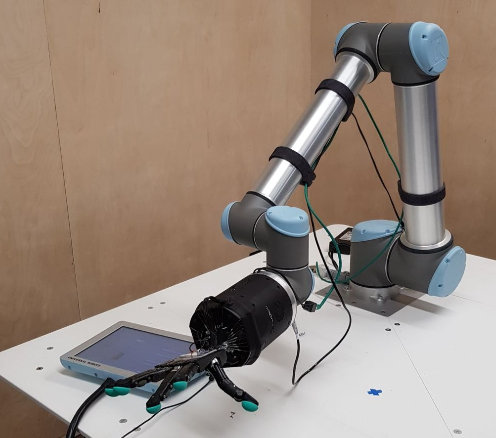

# Setting up the real hardware

This documentation describes the setup of a Shadow Dexterous Hand attached to a UR arm (UR5 or UR10).

```eval_rst
.. image:: ../img/UR10_hand_E.jpeg
  :width: 600
  :align: left
```

<p>

</p>
