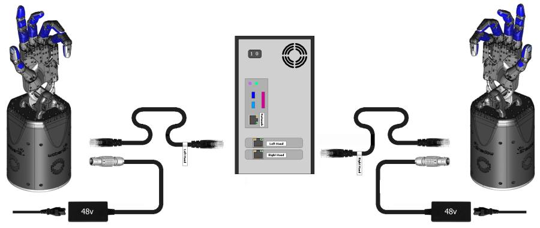
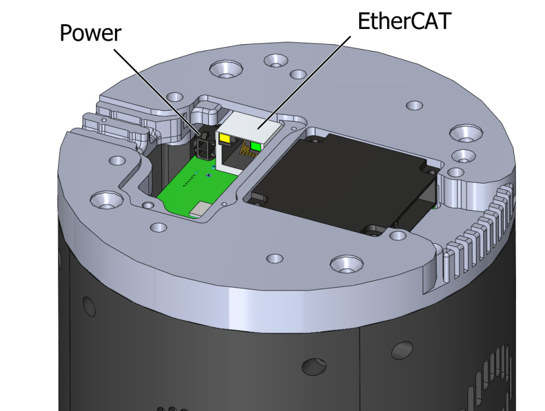

## Setting up the table (If you have a table provided by Shadow)
Unpack the demo table and assemble it as per the instructions [here](https://docs.google.com/document/d/1q7asK4RDGCPR3rHt41VwS1oK7yD3LbegnAYJhy3luhU/edit).

```eval_rst
.. image:: ../img/demo_table.png
```

If you don't have a table provided by Shadow, it should be sturdy surface strong enough to withstand at least 10 times the arm's weight.

## Setting up the arm

1. Unpack the robot arm and the control box.
2. Mount the arm on the table. If you have a demo table, the cable socket should point roughly towards the wire hole in the table. Place the base of the robot onto the mounting plate and add screws from the top. 
   ```eval_rst
   .. image:: ../img/ur_position_on_table.png
   ```
3. Place the control box on its foot and under the table so its not trip hazard.
   ```eval_rst
   .. image:: ../img/ur10_control_box.jpg
   ```
4. Plug on the robot cable between the robot and the control box.
   ```eval_rst
   .. image:: ../img/ur10_control_box_cables.jpg
   ```
5. Plug in the mains plug of the control box.

To quickly start up the robot after it has been installed, perform the following steps:
1. Press the power button on the teach pendant.
2. Wait a minute while the system is starting up, displaying text on the touch screen.
3. Press ON button on the touch screen. Wait a few seconds until robot state changes to idle.
4. Press START button on the touch screen. The robot now makes a sound and moves a little while releasing the brakes.

### Configuring the network

In order to use the robot with our driver you need to change the network setup of the robot via the pendant, performing the following steps:
1. To setup the IP of the robot Press Exit on Initialization screen:

   ```eval_rst
   .. image:: ../img/configure_arm_1.jpg
   ```
   
   You should see the following screen:
   ```eval_rst
   .. image:: ../img/configure_arm_2.jpg
   ```
   
2. Press the "Setup Robot" button and you should see the following screen:
   ```eval_rst
   .. image:: ../img/configure_arm_3.jpg
   ```
   
3. Then press the "Network" button. In this screen, you need to enable the network by clicking the "Static Address" radio button. Change the IP address and Subnet mask as shown below:
   * IP address: 192.168.1.1
   * Subnet mask: 255.255.255.0
   
   ```eval_rst
   .. image:: ../img/configure_arm_4.jpg
   ```
4. Press "Apply" when you finish.

### Arm Calibration Procedure
Follow these steps if you have a table and a stylus provided by Shadow Robot. It should only be ran once when the table is setup for the first time.

1. The arm should be mounted on the table but without hand. First, mount the calibration stylus as shown below:

   ```eval_rst
   .. image:: ../img/arm_calibration_stylus.png
     :width: 200
     :align: center
   ```

2. Attach the ar_marker base to the table without the markers on
   
3. Type CTRL+ALT+T to open a terminal and start arm with command:
   
   ```bash
   roslaunch sr_robot_launch sr_ur10arm_box.launch sim:=false
   ```
   
4. Open another terminal (CTRL+ALT+T) and set the payload with the following command:
   
   ```bash
   rosservice call /ra_sr_ur_robot_hw/set_payload "mass_kg: 0.0
   centre_of_mass_m:
    x: 0.0
    y: 0.0
    z: 0.0"
   ```
   
5. Then, in the same terminal, change the control to `teach_mode` running the following:
   ```bash
   rosservice call /teach_mode "teach_mode: 1 robot: 'right_arm'"
   ```
   Now you should be able to move the arm freely

6. For each marker to be calibrated:
   * Run:
     ```bash
     roslaunch sr_workspace_calibrator calibrator.launch [calibration_frame:=FRAME_NAME]
     ```
     * For multi marker setups, `FRAME_NAME` should be unique. For a single marker setup (most cases), this can be omitted and the default name `ra_calibration_marker` will be used.
     * Follow on screen instructions, touching carefully the tip of stylus into each hole. 
       ```eval_rst
       .. image:: ../img/arm_calibration_holes.png
         :width: 300
         :align: center
       ```
       
       <br>
     
       ```eval_rst
       .. Note:: Hole 0 is nearest to arm base and numbers increase ANTI CLOCKWISE from 0.
       ```
       
   * Repeat 10 times for each hole (0,1,3).    
     
     ```eval_rst
     .. Note:: Hole 2 (shown in red) does not get probed.
     ```
  
7. The output of the process will be a yaml file named FRAME_NAME.yaml stored in sr_workspace_calibrator/config

8. Finally to finish, change the control back running the following command:
   ```bash
   rosservice call /teach_mode "teach_mode: 0 robot: 'right_arm'"
   ```
   Now you should not be able to move the arm

If you want to use a existing calibration, a calibration tf can be broadcast by running:
```bash
roslaunch sr_workspace_calibrator calibration_tf.launch [calibration_frame:=FRAME_NAME]
```

As before, for single marker setups, FRAME_NAME can be omitted and the default ra_calibration_marker will be used. The launch command can of course also be included in other launch files.

### UR10 supporting firmware

In the following table, you can find the firmware version of the Universal Robot software and see if it has been tested with our software:

```eval_rst
+---------------------------+-----------------------------------+-----------------------------------+--------------------+--------------------+---------------+-------------+------------+-------------------+
| UR Software Version       | User Interface                    | Robot Controller                  | Safety Processor A | Safety Processor B | Hostname      | IP address  | s/n        | Tested?           |
+---------------------------+-----------------------------------+-----------------------------------+--------------------+--------------------+---------------+-------------+------------+-------------------+
| 3.3.4.310 (Dec 06 2016)   | PolyScope 3.3.4.310 (Dec 06 2016) | URControl 3.3.4.208 (Dec 06 2016) | URSafetyA 504      | URSafetyB 256      | ur-2017304270 | 192.168.1.1 | 2017304270 | `Yes`__           |
+---------------------------+-----------------------------------+-----------------------------------+--------------------+--------------------+---------------+-------------+------------+-------------------+
| 3.4                       |                                   |                                   |                    |                    |               |             |            | Not tested        |
+---------------------------+-----------------------------------+-----------------------------------+--------------------+--------------------+---------------+-------------+------------+-------------------+
| 3.5                       |                                   |                                   |                    |                    |               |             |            | Not tested        |
+---------------------------+-----------------------------------+-----------------------------------+--------------------+--------------------+---------------+-------------+------------+-------------------+
| 3.6                       |                                   |                                   |                    |                    |               |             |            | Yes in Serfow Lab |
+---------------------------+-----------------------------------+-----------------------------------+--------------------+--------------------+---------------+-------------+------------+-------------------+
| 3.7.0.40195 (Aug 22 2018) |                                   |                                   | URSafetyA (3.5.2)  | URSafetyB (3.5.4)  | ur-2018300632 | 192.168.1.1 | 2018300632 | `Yes`__           |
+---------------------------+-----------------------------------+-----------------------------------+--------------------+--------------------+---------------+-------------+------------+-------------------+
| 3.7.2.40245 (Oct 05 2018) |                                   |                                   | URSafetyA (3.5.2)  | URSafetyB (3.5.4)  | ur-2018301419 | 192.168.1.1 | 2018301419 | Demo Room 1       |
+---------------------------+-----------------------------------+-----------------------------------+--------------------+--------------------+---------------+-------------+------------+-------------------+

__ https://shadowrobot.atlassian.net/projects/SRC?selectedItem=com.atlassian.plugins.atlassian-connect-plugin:com.kanoah.test-manager__main-project-page#!/testPlayer/SRC-R82

__ https://shadowrobot.atlassian.net/projects/SRC?selectedItem=com.atlassian.plugins.atlassian-connect-plugin:com.kanoah.test-manager__main-project-page#!/testPlayer/SRC-R83
```

## Setting up the hand

### What's in the box?

```eval_rst
=========================   ===========================================================
Item                        Description
=========================   ===========================================================
Shadow Hand E2M3 or E2PT    Hand Unit
PC                          Host PC control unit for the hand
PSU for Hand                48v for motor hand
Kettle Leads                To connect power supplies to mains
Power Cable                 4-pin Large Lemo connector, already fitted to the hand
EtherCAT Extension Cable    50cm EtherCAT extension lead, already fitted to the Hand
Calibration Jigs            Bag containing calibration jigs for all joints
Toolbox                     Contains hex drivers to perform required maintenance
User Manual                 This document
=========================   ===========================================================
```

### Connecting Cables
There are two ways to connect the EtherCAT and power cables to the hand.

#### External connections
If your hand already has cables fitted, then you can simply connect the EtherCAT and power connectors immediately.


**EtherCAT**: Connect the Ethernet cable to the hand's Ethernet socket, and connect the other end to the PC's second
Ethernet port. **If you have a Bi-manual system, connect the Left and Right hands correctly to the labelled ports.**
You have been supplied with a medium length Ethernet lead, but if you require a longer or shorter one, you can simply use a standard commercial Ethernet Cat 5 cable, available from most computer parts suppliers.

**Power**: Connect the external power supply to the hand using the metal Lemo connector, making sure to line up the red dots. If you require a longer or shorter cable, please contact the Shadow Robot Company.

#### Internal connections
If you are connecting the hand to a robot with internal cabling, then you may wish to use the internal connectors.
Turn the hand over, and use the orange and green hex drivers to remove the connector cover. Connect the two cables to their relevant sockets. Now affix the hand to the robot arm.


### Mounting the hand

Use the elbow adaptor plate supplied to adapt the Hand to the UR robot arm and mount the hand.

### Powering up

You can power up the hand and PC in any order. You do not have to power up one before the other. When power is applied to the hand, the fans will be heard immediately.

#### Lights

On power up, the lights will be in the following state

```eval_rst
=======================   =============       ================    =================================
Item                      Color               Activity            Meaning
=======================   =============       ================    =================================
Power LEDs                White               On                  Power good
EC Link Active            Green               On                  EtherCAT link established
EC Link Error             Red                 Off                 No EtherCAT link error
Run                       Green               Off                 Hand is in Init state
Application Layer Error   Red                 On (during boot)    Verifying ET1200 EEPROM
Application Layer Error   Red                 Then off            No EtherCAT packet error
ET1200 chip select        Yellow              On                  PIC32 communicating with ET1200
=======================   =============       ================    =================================
```

Lights will also appear inside the base, indicating 5v, 6v and 24v (or 28v) supplies. These can only be seen by removing the covers.

#### Jiggling

This applies to the motor hand only. On reset, all of the strain gauges (torque sensors) in the
motors need to be zeroed. This happens automatically. The motors are driven back and forth
to try to relieve any tension on the tendons. Then both gauges are zeroed. You will therefore
see all joints of the hand move slightly on power up or reset or power up.


