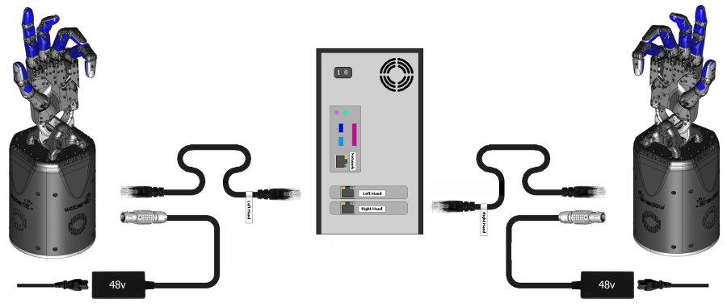
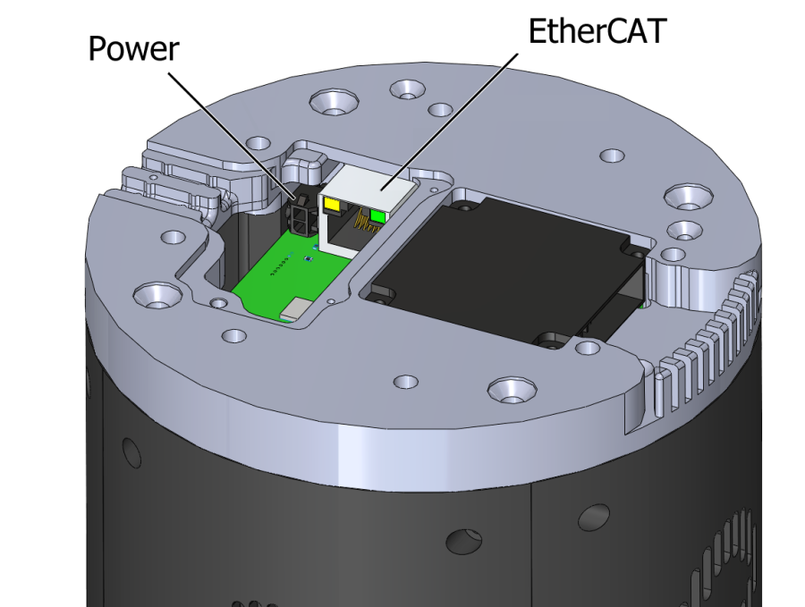

# UR Arm and Dexterous Hand 

This documentation describes the setup of a Shadow Dexterous Hand attached to a UR arm (UR5 or UR10).

```eval_rst
.. image:: ../img/UR10_hand_E.jpeg
  :width: 600
  :align: left
```

## Setting up a real system 

### Setting up the table (If you have a table provided by Shadow)
Unpack the demo table and assemble it as per the instructions [here](https://docs.google.com/document/d/1q7asK4RDGCPR3rHt41VwS1oK7yD3LbegnAYJhy3luhU/edit).

```eval_rst
.. image:: ../img/demo_table.png
```

If you don't have a table provided by Shadow, it should be sturdy surface strong enough to withstand at least 10 times the arm's weight.

### Setting up the arm

1. Unpack the robot arm and the control box.
2. Mount the arm on the table. If you have a demo table, the cable socket should point roughly towards the wire hole in the table. Place the base of the robot onto the mounting plate and add screws from the top. 
   ```eval_rst
   .. image:: ../img/ur_position_on_table.png
   ```
3. Place the control box on its foot and under the table so its not trip hazard.
   ```eval_rst
   .. image:: ../img/ur10_control_box.jpg
   ```
4. Plug on the robot cable between the robot and the control box.
   ```eval_rst
   .. image:: ../img/ur10_control_box_cables.jpg
   ```
5. Plug in the mains plug of the control box.

To quickly start up the robot after it has been installed, perform the following steps:
1. Press the power button on the teach pendant.
2. Wait a minute while the system is starting up, displaying text on the touch screen.
3. Press ON button on the touch screen. Wait a few seconds until robot state changes to idle.
4. Press START button on the touch screen. The robot now makes a sound and moves a little while releasing the brakes.

#### Configuring the network

In order to use the robot with our driver you need to change the network setup of the robot via the pendant, performing the following steps:
1. To setup the IP of the robot Press Exit on Initialization screen:

   ```eval_rst
   .. image:: ../img/configure_arm_1.jpg
   ```
   
   You should see the following screen:
   ```eval_rst
   .. image:: ../img/configure_arm_2.jpg
   ```
   
2. Press the "Setup Robot" button and you should see the following screen:
   ```eval_rst
   .. image:: ../img/configure_arm_3.jpg
   ```
   
3. Then press the "Network" button. In this screen, you need to enable the network by clicking the "Static Address" radio button. Change the IP address and Subnet mask as shown below:
   * IP address: 192.168.1.1
   * Subnet mask: 255.255.255.0
   
   ```eval_rst
   .. image:: ../img/configure_arm_4.jpg
   ```
4. Press "Apply" when you finish.

#### Arm Calibration Procedure
Follow these steps if you have a table and a stylus provided by Shadow Robot. It should only be ran once when the table is setup for the first time.

1. The arm should be mounted on the table but without hand. First, mount the calibration stylus as shown below:

   ```eval_rst
   .. image:: ../img/arm_calibration_stylus.png
     :width: 200
     :align: center
   ```

2. Attach the ar_marker base to the table without the markers on
   
3. Type CTRL+ALT+T to open a terminal and start arm with command:
   
   ```sh
   roslaunch sr_robot_launch sr_ur10arm_box.launch sim:=false
   ```
   
4. Open another terminal (CTRL+ALT+T) and set the payload with the following command:
   
   ```sh
   rosservice call /ra_sr_ur_robot_hw/set_payload "mass_kg: 0.0
   centre_of_mass_m:
    x: 0.0
    y: 0.0
    z: 0.0"
   ```
   
5. Then, in the same terminal, change the control to `teach_mode` running the following:
   ```sh
   rosservice call /teach_mode "teach_mode: 1 robot: 'right_arm'"
   ```
   Now you should be able to move the arm freely

6. For each marker to be calibrated:
   * Run:
     ```sh
     roslaunch sr_workspace_calibrator calibrator.launch [calibration_frame:=FRAME_NAME]
     ```
     * For multi marker setups, `FRAME_NAME` should be unique. For a single marker setup (most cases), this can be omitted and the default name `ra_calibration_marker` will be used.
     * Follow on screen instructions, touching carefully the tip of stylus into each hole. 
       ```eval_rst
       .. image:: ../img/arm_calibration_holes.png
         :width: 300
         :align: center
       ```
       
       <br>
     
       ```eval_rst
       .. Note:: Hole 0 is nearest to arm base and numbers increase ANTI CLOCKWISE from 0.
       ```
       
   * Repeat 10 times for each hole (0,1,3).    
     
     ```eval_rst
     .. Note:: Hole 2 (shown in red) does not get probed.
     ```
  
7. The output of the process will be a yaml file named FRAME_NAME.yaml stored in sr_workspace_calibrator/config

8. Finally to finish, change the control back running the following command:
   ```sh
   rosservice call /teach_mode "teach_mode: 0 robot: 'right_arm'"
   ```
   Now you should not be able to move the arm

If you want to use a existing calibration, a calibration tf can be broadcast by running:
```sh
roslaunch sr_workspace_calibrator calibration_tf.launch [calibration_frame:=FRAME_NAME]
```

As before, for single marker setups, FRAME_NAME can be omitted and the default ra_calibration_marker will be used. The launch command can of course also be included in other launch files.

#### UR10 supporting firmware

In the following table, you can find the firmware version of the Universal Robot software and see if it has been tested with our software:

```eval_rst
+---------------------------+-----------------------------------+-----------------------------------+--------------------+--------------------+---------------+-------------+------------+-------------------+
| UR Software Version       | User Interface                    | Robot Controller                  | Safety Processor A | Safety Processor B | Hostname      | IP address  | s/n        | Tested?           |
+---------------------------+-----------------------------------+-----------------------------------+--------------------+--------------------+---------------+-------------+------------+-------------------+
| 3.3.4.310 (Dec 06 2016)   | PolyScope 3.3.4.310 (Dec 06 2016) | URControl 3.3.4.208 (Dec 06 2016) | URSafetyA 504      | URSafetyB 256      | ur-2017304270 | 192.168.1.1 | 2017304270 | `Yes`__           |
+---------------------------+-----------------------------------+-----------------------------------+--------------------+--------------------+---------------+-------------+------------+-------------------+
| 3.4                       |                                   |                                   |                    |                    |               |             |            | Not tested        |
+---------------------------+-----------------------------------+-----------------------------------+--------------------+--------------------+---------------+-------------+------------+-------------------+
| 3.5                       |                                   |                                   |                    |                    |               |             |            | Not tested        |
+---------------------------+-----------------------------------+-----------------------------------+--------------------+--------------------+---------------+-------------+------------+-------------------+
| 3.6                       |                                   |                                   |                    |                    |               |             |            | Yes in Serfow Lab |
+---------------------------+-----------------------------------+-----------------------------------+--------------------+--------------------+---------------+-------------+------------+-------------------+
| 3.7.0.40195 (Aug 22 2018) |                                   |                                   | URSafetyA (3.5.2)  | URSafetyB (3.5.4)  | ur-2018300632 | 192.168.1.1 | 2018300632 | `Yes`__           |
+---------------------------+-----------------------------------+-----------------------------------+--------------------+--------------------+---------------+-------------+------------+-------------------+
| 3.7.2.40245 (Oct 05 2018) |                                   |                                   | URSafetyA (3.5.2)  | URSafetyB (3.5.4)  | ur-2018301419 | 192.168.1.1 | 2018301419 | Demo Room 1       |
+---------------------------+-----------------------------------+-----------------------------------+--------------------+--------------------+---------------+-------------+------------+-------------------+

__ https://shadowrobot.atlassian.net/projects/SRC?selectedItem=com.atlassian.plugins.atlassian-connect-plugin:com.kanoah.test-manager__main-project-page#!/testPlayer/SRC-R82

__ https://shadowrobot.atlassian.net/projects/SRC?selectedItem=com.atlassian.plugins.atlassian-connect-plugin:com.kanoah.test-manager__main-project-page#!/testPlayer/SRC-R83
```

### Setting up the hand

#### What's in the box?

```eval_rst
=========================   ===========================================================
Item                        Description
=========================   ===========================================================
Shadow Hand E2M3 or E2PT    Hand Unit
PC                          Host PC control unit for the hand
PSU for Hand                48v for motor hand
Kettle Leads                To connect power supplies to mains
Power Cable                 4-pin Large Lemo connector, already fitted to the hand
EtherCAT Extension Cable    50cm EtherCAT extension lead, already fitted to the Hand
Calibration Jigs            Bag containing calibration jigs for all joints
Toolbox                     Contains hex drivers to perform required maintenance
User Manual                 This document
=========================   ===========================================================
```

#### Connecting Cables
There are two ways to connect the EtherCAT and power cables to the hand.

##### External connections
If your hand already has cables fitted, then you can simply connect the EtherCAT and power connectors immediately.


**EtherCAT**: Connect the Ethernet cable to the hand's Ethernet socket, and connect the other end to the PC's second
Ethernet port. **If you have a Bi-manual system, connect the Left and Right hands correctly to the labelled ports.**
You have been supplied with a medium length Ethernet lead, but if you require a longer or shorter one, you can simply use a standard commercial Ethernet Cat 5 cable, available from most computer parts suppliers.

**Power**: Connect the external power supply to the hand using the metal Lemo connector, making sure to line up the red dots. If you require a longer or shorter cable, please contact the Shadow Robot Company.

##### Internal connections
If you are connecting the hand to a robot with internal cabling, then you may wish to use the internal connectors.
Turn the hand over, and use the orange and green hex drivers to remove the connector cover. Connect the two cables to their relevant sockets. Now affix the hand to the robot arm.


#### Mounting the hand

Use the elbow adaptor plate supplied to adapt the Hand to the UR robot arm and mount the hand.

#### Powering up

You can power up the hand and PC in any order. You do not have to power up one before the other. When power is applied to the hand, the fans will be heard immediately.

##### Lights

On power up, the lights will be in the following state

```eval_rst
=======================   =============       ================    =================================
Item                      Color               Activity            Meaning
=======================   =============       ================    =================================
Power LEDs                White               On                  Power good
EC Link Active            Green               On                  EtherCAT link established
EC Link Error             Red                 Off                 No EtherCAT link error
Run                       Green               Off                 Hand is in Init state
Application Layer Error   Red                 On (during boot)    Verifying ET1200 EEPROM
Application Layer Error   Red                 Then off            No EtherCAT packet error
ET1200 chip select        Yellow              On                  PIC32 communicating with ET1200
=======================   =============       ================    =================================
```

Lights will also appear inside the base, indicating 5v, 6v and 24v (or 28v) supplies. These can only be seen by removing the covers.

##### Jiggling

This applies to the motor hand only. On reset, all of the strain gauges (torque sensors) in the
motors need to be zeroed. This happens automatically. The motors are driven back and forth
to try to relieve any tension on the tendons. Then both gauges are zeroed. You will therefore
see all joints of the hand move slightly on power up or reset or power up.


### Installing the software

We have created a one-liner that is able to install Docker, download the image and create a new container for you. It will also create two desktop icons, one to start the container and launch the hand and another one to save the log files locally. To use it, you first need to have a PC with Ubuntu installed on it (preferable version 16.04) then follow these steps:

* **Check your hand interface ID**:

  Before setting up the docker container, the EtherCAT interface ID for the hand needs to be discovered. In order to do so, after plugging the hand’s ethernet cable into your machine and powering it up, please run

  ```bash
  $ sudo dmesg
  ```
  command in the console. At the bottom, there will be information similar to the one below:

  ```bash
  [490.757853] IPv6: ADDRCONF(NETDEV_CHANGE): enp0s25: link becomes ready
  ```
  In the above example, ‘enp0s25’ is the interface ID that is needed.

* **Get ROS Upload login credentials**

  If you want to upload technical logged data (ROS logs, backtraces, crash dumps etc.) to our server and notify the Shadow's software team to investigate your bug then you need to enable logs uploading in the one-liner. In order to use this option you need to obtain a unique upload key by emailing sysadmin@shadowrobot.com. When you receive the key you can use it when running the one-liner installation tool. To enable the logs uploading you need to add the command line option ```use_aws=true``` to the one-liner.
  After executing the one-liner, it will prompt you to enter your upload key and press enter to continue. Please copy and paste your key from the email you received by Shadow Robot.

* **Check your hand configuration branch**:

  You should have the name of your [sr_config](https://github.com/shadow-robot/sr-config) hand branch which contains the specific configuration of your hand (calibration, controller tuning etc…).
  Usually it is something like this: ``shadowrobot_XXXXXX``. Where XXXXXX are the 6 digits contained in the serial number of the hand labelled underneath the robot base.

  If you are unsure please contact us.

* **Run the one-liner**:

  The one-liner will install Docker, pull the image from Docker Hub, and create and run a container with the parameters specified. In order to use it, use the following command:

  **Please remember to replace [EtherCAT interface ID] with your Interface ID and [sr_config_branch] with your unique sr_config branch**

  ROS Kinetic (Recommended):
  ```bash
  $ bash <(curl -Ls bit.ly/run-aurora) docker_deploy product=hand_e ethercat_interface=[EtherCAT interface ID] config_branch=[sr_config_branch]
  ```
  Examples:
  For Interface ID ```ens0s25``` and sr_config_branch ```shadow_12345```
  ```bash
  $ bash <(curl -Ls bit.ly/run-aurora) docker_deploy product=hand_e ethercat_interface=ens0s25 config_branch=shadow_12345
  ```  
  Same as above but with ROS logs upload enabled
  ```bash
  $ bash <(curl -Ls bit.ly/run-aurora) docker_deploy product=hand_e ethercat_interface=ens0s25 config_branch=shadow_12345 use_aws=true
  ```  
  
  If you have an Nvidia graphics card, you can add nvidia_docker to set the nvidia-docker version. Use ``nvidia_docker=1`` or ``nvidia_docker=2`` for version 1.0 or 2.0 respectively.

  You can also add reinstall=true true in case you want to reinstall the docker image and container. When it finishes it will show if it was successful or not
  and it will create five desktop icons on your desktop that you can double-click to launch the hand container, save the log files from the active containers to your desktop and perform various actions on the hand (open, close and demo).

### Saving log files and uploading data to our server
When running the one-liner, you will also notice a second icon named `Save logs` that is used to retrieve and copy all the available logs files from the active containers locally on your Desktop. This icon will create a folder that matches the active container's name and the next level will include the date and timestamp it was executed. When it starts, it will prompt you if you want to continue, as by pressing yes it will close all active containers. After pressing "yes", you will have to enter a description of the logging event and will start coping the bag files, logs and configuration files from the container and then exit. Otherwise, the window will close and no further action will happen. If you provided an upload key with the one-liner installation then the script will also upload your LOGS in compressed format to our server and notify the Shadow's software team about the upload. This will allow the team to fully investigate your issue and provide support where needed.

### Starting the driver

* **Shadow Arm and Hand Driver**
  Launch the driver for the Shadow Hand using the desktop icon 'Shadow_Hand_Launcher' if the one-liner was executed using the ```launch_hand=true``` argument or at a terminal (in the container), type:

  ```bash
  $ roslaunch sr_ethercat_hand_config sr_system.launch
  ```

* **Lights in the hand**:
  When the ROS driver is running you should see the following lights on the Palm:

  ```eval_rst
  ========================   =============       ================    =================================
  Light                      Colour              Activity            Meaning
  ========================   =============       ================    =================================
  Run                        Green               On                  Hand is in Operational state
  CAN1/2 Transmit            Blue                V.fast flicker      Demand values are being sent to the motors
  CAN1/2 Receive             Blue                V.fast flicker      Motors are sending sensor data
  Joint sensor chip select   Yellow              On                  Sensors being sampled
  ========================   =============       ================    =================================
  ```

  After killing the driver, the lights will be in a new state:
  ```eval_rst
  ========================   =============       ================    =================================
  Light                      Colour              Activity            Meaning
  ========================   =============       ================    =================================
  Run                        Green               Blinking            Hand is in Pre-Operational state
  CAN1/2 Transmit            Blue                Off                 No messages transmitted on CAN 1/2
  CAN1/2 Receive             Blue                Off                 No messages received on CAN 1/2
  Joint sensor chip select   Yellow              Off                 Sensors not being sampled
  ========================   =============       ================    =================================
  ```

## Setting up a simulated system 

### Gazebo

[Gazebo](http://gazebosim.org/) is our default simultator. So follow the intructions on the next section to install and run a simulation of our robot hands using Gazebo.

#### Installing the software (sim)

If you do not actually have a real hand and arm but would like to use them in simulation, then please run the following command:

ROS Kinetic (Recommended):
```bash
$ bash <(curl -Ls bit.ly/run-aurora) docker_deploy product=hand_e sim_hand=true launch_hand=true
```

You can also add reinstall=true true in case you want to reinstall the docker image and container. When it finishes it will show:
```bash
Operation completed
```
and it will create two icons on your desktop that you can double-click to launch the container with the system or save the log files.

#### Starting a robot in simulation

First you need to start the system container by either doble clicking the icon "Arm_Hand_Container" or running the following command:
```bash
$ docker start dexterous_hand_real_hw
```
Then, inside the container, launch the arm and hand by running:
```bash
roslaunch sr_robot_launch sr_right_ur10arm_hand.launch
```

## Software description

Check the `Software description` section in the [Dexterous Hand Documentation](https://dexterous-hand.readthedocs.io/en/latest/user_guide/2_software_description.html#), as it contains important information of all the software available for the hand.

### Repositories

Our code is split into different repositories:

* [sr_common](https://github.com/shadow-robot/sr_common): This repository contains the bare minimum for communicating with the Shadow Hand from a remote computer (urdf models and messages).
* [sr_core](https://github.com/shadow-robot/sr_core): These are the core packages for the Shadow Robot hardware and simulation.
* [sr_interface](https://github.com/shadow-robot/sr_interface): This repository contains the high level interface and its dependencies for interacting simply with our robots.
* [sr_tools](https://github.com/shadow-robot/sr_tools): This repository contains more advanced tools that might be needed in specific use cases.
* [sr_visualization](https://github.com/shadow-robot/sr_visualization): This repository contains the various rqt_gui plugins we developed.
* [sr_config](https://github.com/shadow-robot/sr_config): This repository contains the customer specific configuration for the Shadow Robot Hand.

### Robot commander

The robot commander provides a high level interface to easily control the different robots supported by Shadow Robot. It encapsulate the functionality provided by different ROS packages, specially the moveit_commander, enabling their access throughout a more simplified interface.

There are three clases available:
* [SrRobotCommander](https://github.com/shadow-robot/sr_interface/blob/kinetic-devel/sr_robot_commander/src/sr_robot_commander/sr_robot_commander.py): base class. Documentation can be found in the following [link](https://dexterous-hand.readthedocs.io/en/latest/user_guide/2_software_description.html#srrobotcommander).
* [SrHandCommander](https://github.com/shadow-robot/sr_interface/blob/kinetic-devel/sr_robot_commander/src/sr_robot_commander/sr_hand_commander.py): hand management class. Documentation can be found in the following [link](https://dexterous-hand.readthedocs.io/en/latest/user_guide/2_software_description.html#srhandcommander).
* [SrArmCommander](https://github.com/shadow-robot/sr_interface/blob/kinetic-devel/sr_robot_commander/src/sr_robot_commander/sr_arm_commander.py): hand management class

#### SrArmCommander

The SrArmCommander inherits all methods from the [robot commander](https://dexterous-hand.readthedocs.io/en/latest/user_guide/2_software_description.html#srrobotcommander) and provides commands specific to the arm. It allows movement to a certain position in cartesian space, to a configuration in joint space
or move using certain trajectory.

##### Setup
```eval_rst
Import the arm commander along with basic rospy libraries and the arm finder:

.. code:: python

    import rospy
    from sr_robot_commander.sr_arm_commander import SrArmCommander
    from sr_utilities.arm_finder import ArmFinder

The constructors for ``SrArmCommander`` take a name parameter that should match the group name of the robot to be used and has the option to add ground to the scene.

.. code:: python

   arm_commander = SrArmCommander(name="right_arm", set_ground=True)
   
Use the ArmFinder to get the parameters (such as prefix) and joint names of the arm currently running on the system:

.. code:: python

   arm_finder = ArmFinder()
   
   # To get the prefix or mapping of the arm joints. Mapping is the same as prefix but without underscore.
   arm_finder.get_arm_parameters().joint_prefix.values()
   arm_finder.get_arm_parameters().mapping.values()
   
   # To get the arm joints
   arm_finder.get_arm_joints()
```

##### Getting basic information
```eval_rst
To return the reference frame for planning in cartesian space:

.. code:: python

   reference_frame = arm_commander.get_pose_reference_frame()
```

##### Plan/move to a position target
```eval_rst
Using the method ``move_to_position_target``, the end effector of the arm can be moved to a certain point
in space represented by (x, y, z) coordinates. The orientation of the end effector can take any value.

Parameters:

-  *xyz* desired position of end-effector
-  *end\_effector\_link* name of the end effector link (default value is
   empty string)
-  *wait*  indicates if the method should wait for the movement to end or not
   (default value is True)
```
###### Example
```eval_rst

.. code:: python

   rospy.init_node("robot_commander_examples", anonymous=True)
   arm_commander = SrArmCommander(name="right_arm", set_ground=True)

   new_position = [0.25527, 0.36682, 0.5426]
    
   # To only plan
   arm_commander.plan_to_position_target(new_position)
    
   # To plan and move
   arm_commander.move_to_position_target(new_position)
```

##### Plan/move to a pose target
```eval_rst
Using the method ``move_to_pose_target`` allows the end effector of the arm to be moved to a certain pose
(position and orientation) in the space represented by (x, y, z, rot\_x,
rot\_y, rot\_z).

Parameters:

-  *pose* desired pose of end-effector: a Pose message, a PoseStamped
   message or a list of 6 floats: [x, y, z, rot\_x, rot\_y, rot\_z] or a
   list of 7 floats [x, y, z, qx, qy, qz, qw]
-  *end\_effector\_link* name of the end effector link (default value is
   empty string)
-  *wait* indicates if the method should wait for the movement to end or not
   (default value is True)
```
###### Example
```eval_rst

.. code:: python

   rospy.init_node("robot_commander_examples", anonymous=True)
   arm_commander = SrArmCommander(name="right_arm", set_ground=True)

   new_pose = [0.5, 0.3, 1.2, 0, 1.57, 0]
   
   # To only plan
   arm_commander.plan_to_pose_target(new_pose)
   
   # To plan and move
   arm_commander.move_to_pose_target(new_pose)

```
### Creating a new world/scene

In this section, instructions on how to create, modify and save new `.world` and `.scene` file are provided. All the necessary console commands are described in depth, however, it is recommended that the user uses graphical user interface introduced at the end of this section.

#### Using console commands

##### Running template world file

In order to start creating a new world file, first you need to run a launch file with a template world file, i.e.:

```sh
roslaunch sr_world_generator create_world_template.launch
```
This will open Gazebo and Rviz with a robot in place:

```eval_rst
.. image:: ../img/empty_world.png
  :width: 400
  :align: center
```
In most cases, when one of Shadow's robot tables is used, the above command will suffice. However, the launch file can be run with multiple arguments. Arguments available for the launch file:
* **start_home** - if set to `true`, robot will start in a predefined home pose. Default value: `true`
* **scene** - if set to `true`, a scene from world file defined by the world argument will be generated. Default value: `false`
* **initial_z** - value defining positioning of the robot base in the world frame. Default value: `0.7751`
* **world** - path to a world file that will be spawned in gazebo after running the launch file. No default value, needs to be explicitly specified if `scene` argument is set to `true`.

As an example, a launch file starting with robot NOT in home position with a base at 0.5m height would be called as follows:

```sh
roslaunch sr_world_generator create_world_template.launch start_home:=false initial_z:=0.5
```

##### Adding objects to the world

In order to add existing object to the world, navigate to the left hand side bar in Gazebo and click on the **Insert** tab:

```eval_rst
.. image:: ../img/insert_object.png
  :width: 400
  :align: center
```

A list of objects will appear. Please do not use other objects than the ones kept in sr_description_common (i.e. the ones in second drop down on the list):

```eval_rst
.. image:: ../img/object_list.png
  :width: 400
  :align: center
```

In order to add an object, click on its name and move the cursor back to the scene. A shadow of the object will appear that you can move around. Single left click will put the object in a specified location.

```eval_rst
.. image:: ../img/table_added.png
  :width: 400
  :align: center
```

In order to move the object around, click on the object, then click the following icon found at the top of the panel,

```eval_rst
.. image:: ../img/move_object.png
  :width: 400
  :align: center
```

then click back on the object. You can move it around now. It is usually easier to use the appearing axis frame instead of trying to drag the object itself.

Same process process can be done for rotation, after clicking this icon:

```eval_rst
.. image:: ../img/rotate_object.png
  :width: 400
  :align: center
```

It is also possible to set the specific pose of the object in the pose field. You can do that by clicking the object, navigating to the `pose` drop-down on the left-hand side bar and setting desired pose.

```eval_rst
.. image:: ../img/pose_change.png
  :width: 400
  :align: center
```

A video depicting the process described above can by found [here](https://drive.google.com/file/d/1bm6PckbXbUY9ELF_6f4LWAIdXbkIZnQ1/view?usp=sharing).

##### Creating new objects

It is possible to create new object types from both meshes and primitives. First, an object needs to be placed in the scene. You can either drag a mesh that you want to modify as described above or use one of the available primitives that you can see at the top of the panel:

```eval_rst
.. image:: ../img/primitives.png
  :width: 400
  :align: center
```

In this example, we will be using a primitive to create a wall. After inserting the primitive in a scene, it's dimensions can be changed. In order to do that, right click on the model you just inserted and select **Edit model** option:

```eval_rst
.. image:: ../img/edit_model.png
  :width: 400
  :align: center
```

Further, right click the object again and select **Open Link Inspector**.

```eval_rst
.. image:: ../img/link_inspector.png
  :width: 400
  :align: center
```

Inside the **Link Inspector**, go to the **Visual** tab, scroll down to **Geometry** section and select desired dimensions. Further, go to **Collision** tab and do the same. Finally, click OK to confirm the changes. In the below example, a 1x1x1m square was reduced to a thin wall:

```eval_rst
.. image:: ../img/modified_model.png
  :width: 400
  :align: center
```

Next step is to save the model. Go to **File → Save as**. A pop-up window will show:

```eval_rst
.. image:: ../img/save_model.png
  :width: 400
  :align: center
```

For model name, DO NOT use numbers. Other than that, any name would suffice, provided it does not already exist in the models folder. In order to save the model in a proper location, use the **Browse** button and navigate to `models` folder in `sr_description_common` package (should be either `/home/user/projects/shadow_robot/base_deps/src/common_resources/sr_description_common/models` or `/home/user/projects/shadow_robot/base/src/common_resources/sr_description_common/models` directory). When you are ready, use the **Save** button to finish. Your model has now been saved. Go to **File → Exit Model Editor** to close the model editor. Now you can move and rotate the object as discussed in the section above.

As mentioned before, the same process (dimension change and saving) can be used with mesh files.

A video depicting the process described above can by found [here](https://drive.google.com/file/d/1yoLMEdtsf-U4bimTCqofrLLD3mPABT-9/view?usp=sharing).

##### Generating proper world file

When all the models are inserted in the scene and placed in desired position, the world file can be saved. Go to **File → Save World As** and select a name and a path of a world file saved with gazebo. Make sure to remember the path to the file. Recommend path is just `/home/user`. Although the file has now been saved, it has to be modified before being used by our launch files. In order to modify it, first kill the currently running Gazebo launch file and run:

```sh
roslaunch sr_world_generator save_world_file.launch gazebo_generated_world_file_path:=path_to_file output_world_file_name:=file_name
```

where:
* **path_to_file** - path to file that was previously saved through gazebo,
* **file_name** -  desired name of the file (without extension). If not set, defaults to `new_world`.

When a message `World saved!` will appear in the console, kill the launch file. Your world has now been saved in `sr_description_common` package (`worlds` folder) and is ready to be used.

##### Creating a scene file

In order to generate a scene file for collision scene used in non-simulated scenarios, first, run the initial launch file with the just created world file passed to the `world` argument:

```sh
roslaunch sr_world_generator create_world_template.launch scene:=true world:=path_to_world
```

where **path_to_world** is the full path to the world file that just has been generated. When Rviz starts, on the left hand side, navigate to the **Scene Objects** tab

```eval_rst
.. image:: ../img/create_scene.png
  :width: 400
  :align: center
```

and click **Export As Text**. A pop-up window will appear asking for a name and path for the file. It is recommended that the file is saved in the sr_description_common package, scenes folder and it's name is the same as the corresponding world file.

A video depicting the process described above can by found [here](https://drive.google.com/file/d/1Uv1MeC2xc1nZ8Ati1cKaegHN8LJzsyhM/view?usp=sharing).

###v Using the graphical user interface

A GUI has been implemented to help with the above operations.

```eval_rst
.. image:: ../img/world_generator_gui.png
  :width: 400
  :align: center
```

 In order to start it, make sure no Gazebo sessions are up and run:

```sh
roslaunch sr_world_generator world_generator_gui.launch
```

In order to start a new Gazebo session set following parameters to your preference:
* **start home** - choose `yes` if you want the robot to be starting in it's home pose
* **empty world** - choose `yes` if you want to start with an empty world. Choose `no` if you want to start the session with a specific world file loaded. You can type the path to the world file in the edit box or navigate to the file using the `browse` button
* **initial z** - set `z` position of the robot base. Default value corresponds to tables used at Shadow

After setting the above parameters to your preference, click `Open`. A new session of Gazebo will start. After modifying the world to your liking, as in the instructions in the previous sections, go to `File → Save World As` and select a name and a path of a world file. Make sure to remember the path to the file. Recommended path is just `/home/user`. Although the file has now been saved, it has to be modified before being used by our launch files. In order to do that, first kill current Gazebo session using the `Close` button in the `Open Gazebo` section of the GUI. Then use the `Transform world file` area to navigate to your newly created Gazebo world file and click `Transform`. A pop-up window will appear asking for the properly formatted world file name. After clicking `Save` your file will be created and will be ready to be used.

You can use the `Open Gazebo` section again to check your newly created world file and export it to the `scene` file as described in the sections above.